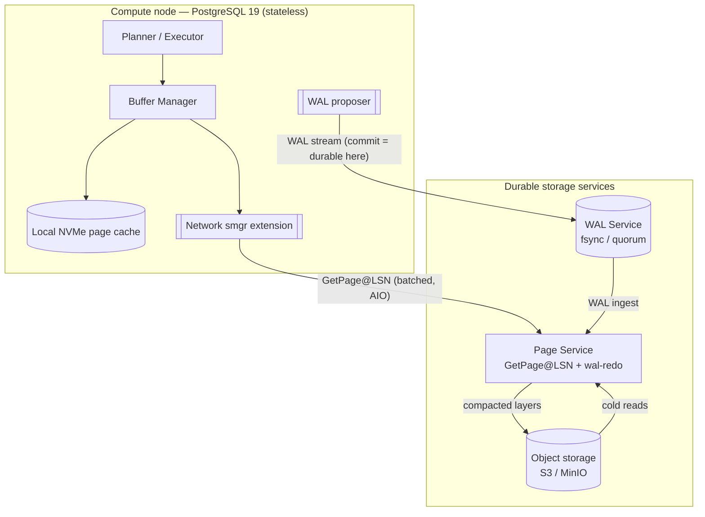

# Disaggregated PostgreSQL: Proof-of-Concept Evaluation Plan

**Status:** Draft for review
**Scope:** Evaluate the prospect of building a proof-of-concept (PoC) PostgreSQL in which the
**front-end query engine (compute)** is separated from the **back-end storage engine (storage)**.
**Baseline engine:** PostgreSQL 19 (latest release), so that new capabilities are exploited where they change what is feasible.

> This document is a standalone architecture-evaluation plan. It is intentionally independent of any
> other project in this repository.

---

## 1. Purpose and framing

Traditional PostgreSQL couples the query engine and the storage engine inside a single process tree
that owns a local filesystem. The buffer manager reads and writes 8 KB pages through the storage
manager (`smgr` → `md.c`) to local files, and the write-ahead log (WAL) is flushed to a local disk.
Compute and durability are therefore bound to one machine's CPU, memory, and disk.

A **disaggregated** design breaks that coupling: stateless compute nodes execute SQL, and a separate,
independently scalable storage service owns durability, page materialization, and history. The
industry has now shipped three distinct public takes on this idea — **Amazon Aurora**, **Google
AlloyDB**, and **Neon** — which gives us concrete, well-documented prior art to learn from rather than
inventing from first principles.

This plan does two things:

1. **Defines the evaluation methodology** — how we will survey prior art, choose a seam, and judge
   feasibility.
2. **Delivers the initial output** — a proposed PoC architecture, its trade-offs, and a
   level-of-effort (LoE) estimate for a working implementation.

### 1.1 Goals of the PoC

- Prove that an **unmodified-as-possible PostgreSQL 19 query engine** can run against a **remote page
  service** instead of a local filesystem.
- Prove that **durability can be satisfied by streaming WAL to a separate service** rather than
  fsync-ing to a local disk.
- Demonstrate at least one capability that disaggregation unlocks and monolithic Postgres cannot do
  cheaply — e.g. **fast, stateless compute restart** or **copy-on-write branching**.
- Produce measurements good enough to decide whether a production effort is justified.

### 1.2 Non-goals for the PoC

- Not building a multi-tenant, production-grade, HA cloud service.
- Not achieving performance parity with local NVMe on first pass.
- Not implementing every offload (vacuum, index build, analytics) into the storage tier.
- Not shipping a new SQL grammar or a new table access method for end users to author against.

---

## 2. Evaluation methodology

The evaluation proceeds in five workstreams. Workstreams A–C are analysis; D–E produce the PoC.

| # | Workstream | Key questions | Output |
|---|------------|---------------|--------|
| A | Prior-art teardown | Where does each product cut the seam? What crosses the network? | Comparison matrix (§3) |
| B | Seam selection | Which PostgreSQL interface is the cleanest cut for a PoC? | Decision + rationale (§4) |
| C | PG19 capability review | What does PostgreSQL 19 newly enable or simplify? | Capability notes (§5) |
| D | Reference architecture | What is the smallest architecture that proves the thesis? | Proposed design (§6) |
| E | Feasibility & LoE | How hard is it, and what are the risks? | Trade-offs (§7) + LoE (§8) |

**Method for A:** read the public architecture material (vendor docs, engineering blogs, the Aurora
SIGMOD 2018 paper, and the Neon open-source codebase) and normalize each design onto the same set of
axes: what is the compute/storage interface, what is the unit of durability, how are pages
materialized, how is history kept, and what is offloaded to storage.

**Method for E:** decompose the chosen architecture into components, size each by novelty and
integration risk (not calendar time), and identify the two or three technical risks most likely to
sink the PoC.

---

## 3. Survey of existing public architectures

All three products separate compute from storage, but they cut the seam in different places and push
different amounts of database logic *into* the storage tier. The single most important idea shared by
all three is **"the log is the database"**: writes are made durable as WAL, and data pages are
materialized from that log rather than being written to a shared block device by the compute node.

### 3.1 Amazon Aurora (PostgreSQL-compatible)

- **Seam:** The compute node is a modified PostgreSQL that **does not write data pages to storage at
  all**. It ships only **redo log records** to a purpose-built distributed storage fleet. "The log is
  the database."
- **Durability unit:** The volume is divided into 10 GB **protection groups**, each replicated to
  **6 copies across 3 Availability Zones**. Writes use a **4-of-6 write quorum**; reads a 3-of-6 read
  quorum. A later optimization mixes *full* segments (pages + log) with *tail* segments (log only),
  cutting physical amplification from ~6× to a little over 3×.
- **Page materialization:** Storage nodes **replay redo records into data pages asynchronously**, in
  the background, off the commit path. Pages are also backed up to S3.
- **LSN discipline:** A single monotonically increasing LSN space, allocated by the primary, lets
  Aurora **avoid distributed consensus** for I/O, commits, and most membership changes.
- **Reads:** Read replicas share the same storage volume (no re-copying data); they receive a stream
  of changes to update their buffer caches.
- **Takeaway for us:** The purest form of disaggregation, but it requires **deep, invasive changes to
  the PostgreSQL write path** and a bespoke storage fleet. Too much to reproduce faithfully in a PoC.

### 3.2 Google AlloyDB

- **Seam:** Disaggregated compute and storage, but the **storage layer is itself disaggregated into
  three services**:
  1. a low-latency **log storage service** (fast synchronous WAL persistence),
  2. a **Log Processing Service (LPS)** that replays WAL into materialized blocks *and* serves those
     blocks to compute (it speaks the Postgres buffer-cache interface), and
  3. a **distributed block storage service** (sharded, zone-replicated).
- **Offload:** Many database operations (log replay, page materialization, and some maintenance) are
  **offloaded to the storage tier**, so the primary can focus on query processing → higher write
  throughput. LPS scales out independently to avoid hotspots without copying data.
- **Caching:** Compute nodes add an **"ultra-fast cache"** (local SSD) beyond the buffer cache; cache
  misses are served by the LPS, which itself caches blocks from block storage.
- **Reads:** Read pools scale horizontally and share the regional storage.
- **Takeaway for us:** Confirms the value of an **intelligent, database-aware storage tier** that both
  materializes and serves pages. The three-way split is a production optimization; a PoC can collapse
  it into one page service.

### 3.3 Neon (open source; also the basis of Databricks Lakebase)

- **Seam:** The cleanest and best-documented cut for our purposes. Neon leaves PostgreSQL largely
  intact and **replaces the storage manager (`smgr`) implementation via an extension** loaded through
  `shared_preload_libraries`. Local file reads/writes become network requests.
- **Two layers connected by WAL:**
  - **Ephemeral compute:** stateless Postgres, optimized with RAM + local NVMe cache; owns no durable
    state and can be replaced freely.
  - **Durable storage:** **safekeepers** (Paxos-based WAL quorum, typically 3, defining commit) plus
    **pageservers** (materialize and serve page versions) plus **object storage (S3)** as the bottom
    tier and source of truth for cold history.
- **Read path — `GetPage@LSN`:** every page read from compute to pageserver carries an **LSN**; the
  pageserver returns the page **as of that LSN** by finding the latest base image and replaying WAL on
  top. To answer at the right version, compute tracks the **last-written LSN** per page (mostly in
  `smgrwrite()`, with a few explicit `SetLastWrittenPageLSN()` calls). Internally the pageserver is a
  key-value store keyed by (relation, block) → page image or WAL record.
- **WAL redo isolation:** the pageserver reuses the `postgres` binary in a special `--wal-redo` mode,
  sandboxed with `seccomp`, to replay WAL for a single page; some record types (e.g. SLRU/commit) are
  handled by bespoke code.
- **What disaggregation buys:** **scale-to-zero** (idle compute is removed, ~sub-second cold start on
  reconnect), **copy-on-write branching**, **instant point-in-time restore / time travel** — all as
  metadata operations, because storage is non-overwriting and log-structured.
- **Takeaway for us:** **This is the model a PoC should imitate**, because the seam (`smgr`) is a
  bounded interface and the reference implementation is open source.

### 3.4 Comparison matrix

| Dimension | Aurora | AlloyDB | Neon |
|---|---|---|---|
| Compute/storage seam | Redo-log shipping (page writes removed) | Disaggregated compute + 3-part storage | `smgr` replacement in compute + page service |
| What crosses the network (write) | Redo log records only | WAL to log store | WAL to safekeepers |
| What crosses the network (read) | — (replicas get change stream) | Block fetch from LPS | `GetPage@LSN` from pageserver |
| Durability unit | 10 GB protection group, 6 copies / 3 AZ, 4/6 quorum | Regional log store + sharded block storage | 3 safekeepers, Paxos quorum + S3 |
| Page materialization | Storage nodes replay redo | LPS replays WAL | Pageserver replays WAL on demand |
| Cold tier | S3 | Regional block storage | Object storage (S3) |
| Offload to storage | Page write/replay, backup | Replay, page serve, maintenance | Replay, page serve, GC/compaction |
| Standout capability | AZ+1 durability, low write amplification | Independent read pools, storage-side offload | Scale-to-zero, branching, time travel |
| Openness | Proprietary | Proprietary (Postgres fork) | **Open source** |
| Ease of PoC imitation | Low (invasive) | Low–medium (fork) | **High (extension seam)** |

**Cross-cutting lessons that shape the PoC:**

1. **Ship the log, materialize lazily.** In every design, commit durability = WAL persisted to a
   quorum; page materialization happens later/elsewhere. The PoC should adopt the same split.
2. **A stable LSN discipline is the linchpin.** Reads must be answerable "as of an LSN," and compute
   must know which LSN it needs. This is where correctness lives.
3. **Caching hides network latency.** All three keep a hot working set close to compute (buffer cache
   + local SSD). A disaggregated PoC that skips caching will look artificially slow.
4. **The `smgr` boundary is the least invasive seam** and is exactly where Neon cut — making it the
   right choice for a PoC.

---

## 4. Seam selection: where to cut PostgreSQL

There are three candidate interfaces at which to separate compute from storage. We evaluate each for
PoC suitability.

| Candidate seam | What it intercepts | Pros | Cons | PoC verdict |
|---|---|---|---|---|
| **Storage Manager (`smgr` / `f_smgr`)** | Page-level read/write/extend/nblocks per relation fork | Narrow, well-defined; proven by Neon; keeps buffer manager & executor untouched | Not yet extension-pluggable in core (see §5); needs the redo/`GetPage@LSN` machinery | **Chosen** |
| **Table Access Method (TAM)** | Tuple-level access per table | Officially pluggable since PG12; no core patch | Wrong granularity — indexes, FSM/VM forks, and system catalogs still go through `smgr`; would not actually disaggregate storage | Rejected for this goal |
| **Redo-log shipping (Aurora-style)** | The entire write path; page writes removed | Purest disaggregation, lowest write amplification | Deeply invasive to the buffer manager, checkpointer, and recovery; effectively a fork | Rejected for PoC (revisit for production) |

**Decision:** cut at the **`smgr` boundary**, exactly as Neon does. The buffer manager keeps calling
`smgrread`/`smgrwrite`/`smgrnblocks`/`smgrextend`; our implementation turns those into network calls
to a page service, and durability is provided by streaming WAL to a WAL service. This isolates the
change to a bounded surface and lets us reuse the unmodified executor, planner, and buffer manager.

---

## 5. PostgreSQL 19 considerations (what changes the calculus)

PostgreSQL 19 does **not** ship a committed pluggable storage-manager API — but it materially improves
the surrounding machinery that a disaggregated storage layer depends on. The net effect is that PG19
makes a `smgr`-based PoC **more performant and better observable**, while the seam itself still
requires an out-of-core patch or a minimal core fork.

### 5.1 Asynchronous I/O (the big one for disaggregation)

Disaggregated storage replaces microsecond-scale local page reads with **network round trips** that
are one to three orders of magnitude slower. Latency-hiding is therefore not optional — it is the
difference between "usable" and "unusable." PostgreSQL 18 introduced the AIO subsystem; **PostgreSQL
19 builds on it**:

- **`io_method=worker` now auto-scales** the number of I/O workers between the new `io_min_workers`
  and `io_max_workers` settings.
- **Improved read-ahead scheduling for large requests**, so sequential/bulk reads issue bigger,
  batched I/Os — ideal for amortizing network latency to a page service.
- **`EXPLAIN ANALYZE ... IO`** now reports AIO activity, giving us direct visibility into how many
  page fetches a query issues and how they overlap.

**Why this matters:** the ongoing extensible-`smgr` patch work explicitly added *extensible AIO handle
callbacks* (so `startreadv`-style reads route through the async infrastructure). Combined with PG19's
AIO improvements, a network-backed `smgr` can issue **prefetch/batched reads** against the page
service and overlap them, rather than serializing one blocking round trip per 8 KB page. This is the
single most important PG19 lever for making the PoC feel fast.

### 5.2 Observability improvements that de-risk the PoC

- **`pg_stat_recovery`** (new) — visibility into WAL apply/recovery, useful when validating the
  WAL-shipping and replay path.
- **WAL full-page-write byte counts** reported in `VACUUM`/`ANALYZE` output — helps quantify the WAL
  volume the storage tier must ingest.
- **Per-process-type `log_min_messages`** — lets us crank logging on just the storage-facing
  processes.
- **`EXPLAIN ANALYZE` `IO` option** — see §5.1.

### 5.3 Features that inform the trade-off discussion

- **Parallel autovacuum** and **native `REPACK` / `REPACK CONCURRENTLY`** are storage-heavy
  maintenance operations. In a monolith they run in compute; Aurora/AlloyDB *offload* equivalents to
  storage. The PoC will keep them in compute (simplest), but their existence in PG19 sharpens the
  future-work argument for storage-side offload.
- **`pg_plan_advice`** (planner guidance) is orthogonal to storage but useful for stabilizing plans
  while benchmarking the seam.

### 5.4 The seam itself in the PG19 era

The **extensible storage manager API is still out-of-core** as of PG19 (community patch set, most
recently rebased in early 2026 by Percona/Neon contributors; registration-based design, not a raw
hook). Practical implications for the PoC:

- **Option 1 — Patch set:** apply the out-of-tree "expose `f_smgr` to extensions" + registration
  patches on top of PG19 and implement our `smgr` as an extension. Cleanest long-term; carries rebase
  risk.
- **Option 2 — Minimal core fork:** as Neon does, make a small number of core changes to expose the
  `smgr` switch and add `SetLastWrittenPageLSN()`-style hooks, then keep the bulk of logic in an
  extension. Most predictable for a PoC.
- **Option 3 — Pre-patched distribution:** build on a distribution that already exposes the SMGR/WAL
  APIs (e.g. Percona's patched server, which added these hooks to enable `pg_tde`).

**Recommendation:** start with **Option 2** (minimal, well-understood fork surface mirroring Neon),
and track the extensible-`smgr` patch to migrate toward **Option 1** if/when it lands in core.

---

## 6. Proposed PoC architecture

The PoC is the **smallest system that proves the thesis**: unmodified-as-possible PostgreSQL 19
compute, a network `smgr`, a WAL service for durability, and a page service that materializes pages
from WAL on demand. It deliberately collapses the production-grade multiplicity (quorums, sharding,
multi-tenancy) into single-node services.

### 6.1 Components

1. **Compute node — PostgreSQL 19 query engine**
   - Runs the normal planner/executor/buffer manager.
   - Loads a **`neon-style` storage-manager extension** (`shared_preload_libraries`) that implements
     the `smgr` interface as **network calls** to the Page Service, and a **WAL proposer** that
     streams WAL to the WAL Service instead of (only) fsync-ing locally.
   - Keeps a **local NVMe/file cache** ("local page cache") in front of the Page Service to hide
     latency, plus the ordinary shared-buffers cache.
   - Uses **PG19 AIO** to issue **batched/prefetched `GetPage@LSN` reads**.
   - Tracks **last-written LSN** per page so reads request the correct version.

2. **WAL Service (durability)**
   - Accepts the WAL stream; a **commit is acknowledged once WAL is durably persisted** here.
   - PoC: a **single durable node** (append to local disk + fsync), exposing an append + read-stream
     API. (Production would replace this with a Paxos/Raft quorum of safekeepers.)

3. **Page Service (materialization + serving)**
   - Ingests WAL from the WAL Service and organizes it as a **key-value store keyed by
     `(relation, fork, block)`** holding base page images + subsequent WAL records.
   - Serves **`GetPage@LSN`**: find the latest base image ≤ LSN, replay WAL on top, return the page.
   - Reuses the **`postgres --wal-redo` process** for replay (sandboxed), mirroring Neon, so we don't
     reimplement redo for every WAL record type.
   - Periodically **checkpoints/compacts** materialized pages down to object storage.

4. **Object Storage (cold tier / source of truth)**
   - S3-compatible (e.g. MinIO for local PoC). Holds immutable, compacted layer files.

5. **(Optional) Control/branch metadata**
   - A tiny metadata store to demonstrate **branching / PITR** as a metadata operation (create a new
     compute pointed at an older LSN).

### 6.2 Write path

```
SQL write → buffer manager marks page dirty + generates WAL
        → WAL proposer streams WAL records to WAL Service
        → WAL Service fsyncs → ACK → transaction commits
        → (async) Page Service ingests WAL, updates its (rel,block)->{image,records} store
        → (async) Page Service compacts materialized layers to object storage
```

Note: the compute node **never writes data pages to shared storage** — only WAL crosses the durability
boundary, exactly as in Aurora/AlloyDB/Neon.

### 6.3 Read path

```
Executor needs page → shared buffers?  → hit: done
                    → miss → local page cache? → hit: done
                    → miss → smgr issues GetPage@LSN(rel, block, last_written_lsn)
                             (batched/prefetched via PG19 AIO)
                    → Page Service returns page as of LSN → fill caches → done
```

### 6.4 Architecture diagram



### 6.5 What the PoC will demonstrate (acceptance criteria)

- **Correctness:** `make installcheck` (core regression suite) passes with the network `smgr` +
  WAL service in place; `pgbench` runs correctly.
- **Durability:** kill `-9` the compute node mid-load; a **fresh, stateless compute** attaches to the
  same storage and recovers with **no committed-data loss**.
- **Disaggregation payoff (pick ≥1):**
  - **Stateless restart:** new compute serves queries in seconds without copying the dataset, **or**
  - **Branching:** create a second compute pointed at an earlier LSN and query historical state.
- **Performance envelope:** measured `pgbench` TPS and p95 latency vs. stock local-disk PG19, with an
  **AIO-on vs AIO-off** comparison quantifying the latency-hiding benefit.

---

## 7. Trade-offs of the proposed architecture

### 7.1 Advantages

- **Minimal blast radius in Postgres.** Cutting at `smgr` reuses the planner, executor, and buffer
  manager unchanged. Correctness risk is concentrated in one bounded interface.
- **Proven design.** It follows the open-source Neon model, so we can consult a working reference for
  the hardest details (LSN tracking, `GetPage@LSN`, `wal-redo`).
- **Unlocks cloud-native capabilities** even at PoC scale: stateless/scale-to-zero compute, branching,
  and time travel — none of which monolithic Postgres does cheaply.
- **Independent scaling** of compute and storage; multiple read computes can share one storage.
- **Rides PG19 momentum.** AIO improvements directly mitigate the primary drawback (network latency),
  and new stats views make the seam observable.

### 7.2 Costs and risks

- **Read latency & amplification.** A buffer miss becomes a network round trip. Mitigations: local
  NVMe cache, generous shared buffers, and **PG19 AIO batching/prefetch**. This is the dominant
  performance risk and must be measured early.
- **LSN correctness is subtle.** Requesting a page at the wrong LSN yields stale or too-new data.
  Getting last-written-LSN tracking right (including relation extension, FSM/VM forks, and unlogged
  edge cases) is the top *correctness* risk.
- **WAL-redo coverage.** The Page Service must correctly replay all WAL record types it will see
  (heap, btree, SLRU/commit, etc.). Reusing `postgres --wal-redo` reduces but does not eliminate this
  work; some record types need bespoke handling.
- **Not-yet-in-core seam.** Depending on an out-of-core `smgr` patch or a minimal fork means **rebase
  maintenance against future PostgreSQL releases** until (if) the extensible API lands.
- **Commit-latency floor.** Commit now waits on the WAL Service's fsync/quorum ACK over the network,
  not a local fsync. Single-node WAL service keeps this low for the PoC; a production quorum adds a
  round trip.
- **Feature interactions deferred.** Maintenance offload (vacuum/`REPACK`), parallel query across
  read replicas, and multi-tenancy are explicitly out of PoC scope and represent significant future
  work.
- **Operational surface grows.** Three services instead of one process; more moving parts to run and
  debug (partly offset by PG19 observability).

### 7.3 Explicitly deferred (production concerns, not PoC)

Quorum/consensus for WAL and pages, sharding, multi-AZ placement, security/multi-tenant isolation,
autoscaling, backup lifecycle, and connection pooling/proxy. These are what separate a PoC from
Aurora/AlloyDB/Neon and should be scoped only after the PoC validates the core thesis.

---

## 8. Level-of-effort evaluation

Effort is expressed by **component novelty and integration risk**, not calendar time. Each item is
rated **Low / Medium / High** for both **effort** and **risk**, with the driver called out.

| # | Work item | Effort | Risk | Primary driver |
|---|-----------|:------:|:----:|----------------|
| 1 | Build PG19 with SMGR seam exposed (minimal fork or patch set) | Medium | Medium | Rebasing out-of-core patches; understanding `f_smgr` |
| 2 | Network `smgr` extension (read/write/extend/nblocks → RPC) | Medium | Medium | Correct mapping of every `smgr` entry point |
| 3 | Last-written-LSN tracking on compute | Medium | **High** | Correctness of `GetPage@LSN` versioning |
| 4 | WAL proposer: stream WAL to WAL Service; commit = remote ACK | Medium | Medium | Hooking WAL flush without breaking recovery |
| 5 | WAL Service (single-node durable append + read stream) | Low | Low | Straightforward append log |
| 6 | Page Service: `(rel,block)->{image,WAL}` store + `GetPage@LSN` | High | **High** | The core of the system |
| 7 | WAL redo via `postgres --wal-redo` integration | Medium | Medium | Record-type coverage; sandboxing |
| 8 | Object-storage compaction (layer files to S3/MinIO) | Medium | Low | Layer format + GC |
| 9 | Local NVMe page cache on compute | Low | Low | Cache fill/evict around `smgr` |
| 10 | PG19 AIO integration for batched `GetPage@LSN` | Medium | Medium | Extensible AIO callbacks; prefetch tuning |
| 11 | Branching / PITR demo (point compute at older LSN) | Low | Low | Metadata pointer; storage is non-overwriting |
| 12 | Test & benchmark harness (`installcheck`, `pgbench`, crash test) | Medium | Low | Reproducible measurement |

**Overall assessment:** **Medium–High effort, concentrated risk.** The bulk of both effort and risk
lives in **three items — #3 (LSN tracking), #6 (Page Service), and #7 (WAL redo)**, which together
form the correctness core. Everything else is standard systems plumbing. The existence of Neon as an
open-source reference substantially de-risks all three, because the hard design questions have public,
working answers to consult.

### 8.1 Suggested phasing (each phase is independently demoable)

- **Phase 0 — Spike:** Build PG19 with the SMGR seam; implement a **pass-through `smgr`** that still
  writes to local files but through the extension. Proves the seam compiles and the buffer manager is
  satisfied. *(Effort: Low)*
- **Phase 1 — Remote reads:** Introduce the Page Service and route `smgrread`/`smgrnblocks` over the
  network with a naive full-page store (no WAL redo yet); writes still local. Proves `GetPage`. *(Effort: Medium)*
- **Phase 2 — Ship the WAL:** Add the WAL proposer + WAL Service; make commit depend on remote ACK;
  Page Service ingests WAL and materializes pages via `wal-redo`; add last-written-LSN tracking.
  **This is the milestone that proves the thesis.** *(Effort: High)*
- **Phase 3 — Make it credible:** Local NVMe cache + PG19 AIO batching; object-storage compaction;
  crash/restart durability test; `pgbench` and AIO-on/off benchmarks. *(Effort: Medium)*
- **Phase 4 — Show the payoff:** Stateless compute restart and/or branching/PITR demo. *(Effort: Low)*

### 8.2 Go / no-go gates

- **After Phase 2:** Does regression pass and does a stateless compute recover committed data after a
  crash? If not, reconsider the seam or the LSN model before investing further.
- **After Phase 3:** Is the read-latency penalty tolerable with caching + AIO (target: within a small
  multiple of local disk on cached working sets)? This determines whether a production effort is
  worthwhile.

---

## 9. Risks, open questions, and recommendation

**Top risks (ranked):**
1. **LSN versioning correctness** (#3) — most likely source of subtle data bugs.
2. **WAL-redo completeness** (#7) — an unhandled record type = wrong pages.
3. **Read-latency penalty** — could make the PoC look unattractive if AIO/caching underdeliver.
4. **Seam maintenance** — out-of-core patch drift against PostgreSQL releases.

**Open questions to resolve during Phase 0–1:**
- Adopt the out-of-core extensible-`smgr` patch (Option 1) or a minimal fork (Option 2)?
- How much of Neon's open-source page-service design do we reuse conceptually vs. build minimally?
- What is the smallest WAL-record set we must support to run `installcheck` + `pgbench`?

**Recommendation:** The prospect is **feasible and worth a PoC.** The `smgr` seam plus PG19's improved
AIO make a compelling, bounded target, and Neon provides an open-source reference that removes most of
the design uncertainty. Proceed through **Phase 2 as the primary go/no-go milestone**, keeping the
production-grade concerns of §7.3 explicitly out of scope until the core thesis is proven.

---

## 10. References

- Amazon Aurora storage engine (AWS Database Blog): <https://aws.amazon.com/blogs/database/introducing-the-aurora-storage-engine/>
- Aurora quorum sets / full vs tail segments (AWS Database Blog): <https://aws.amazon.com/blogs/database/amazon-aurora-under-the-hood-reducing-costs-using-quorum-sets/>
- "Amazon Aurora: On Avoiding Distributed Consensus…" (SIGMOD 2018): <https://pages.cs.wisc.edu/~yxy/cs764-f20/papers/aurora-sigmod-18.pdf>
- AlloyDB intelligent, scalable storage (Google Cloud Blog): <https://cloud.google.com/blog/products/databases/alloydb-for-postgresql-intelligent-scalable-storage>
- AlloyDB overview (Google Cloud docs): <https://docs.cloud.google.com/alloydb/docs/overview>
- Neon architecture overview: <https://neon.com/docs/introduction/architecture-overview>
- Neon storage engine deep dive (`GetPage@LSN`): <https://neon.com/blog/get-page-at-lsn>
- Neon core changes & `smgr` hook (source): <https://github.com/neondatabase/neon/blob/main/docs/core_changes.md>
- Neon pageserver WAL redo (source): <https://github.com/neondatabase/neon/blob/main/docs/pageserver-walredo.md>
- PostgreSQL 19 Beta 1 announcement: <https://www.postgresql.org/about/news/postgresql-19-beta-1-released-3313/>
- PostgreSQL 19 release notes: <https://www.postgresql.org/docs/19/release-19.html>
- Extensible storage manager API (CommitFest #5616): <https://commitfest.postgresql.org/patch/5616/>
- Extensible `smgr` API — SMGR hook Redux (pgsql-hackers): <https://www.postgresql.org/message-id/CAEze2WgMySu2suO_TLvFyGY3URa4mAx22WeoEicnK%3DPCNWEMrA%40mail.gmail.com>
